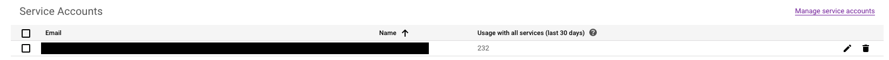

# Google Sheet to JSON

Google Sheets is a powerful data collaboration tool, but turning it into a static JSON file can be quite a cumbersome process. You can publish the sheet to the web, but if a webpage makes too many connections with the sheet, your Google account can get temporarily restricted, your access to the sheet will get blocked and the page that relies on the sheet will break.

You could also use it with a site like Mr. Data Converter, but that's a multi-step process that would need to be repeated every time the data changes.

This is a simple script that opens a Google sheet, writes its contents to a JSON file and pushes it to S3.

## Running the script

Once all setup has been completed, simply type `pipenv run python sheet_to_json.py` in the terminal from this directory.

## Setup

Before cloning this repository, you'll need some Python dependencies installed. The script will not run without these dependencies.

1. Python 3.6 (Available on Self Service)
1. pipenv (`brew install pipenv`)
1. AWS credentials (to push the JSON file to S3)
1. Access to the teamjpg Gmail account (you can also use a personal Gmail account)

After you have installed/have access to all the items in the list above, clone the repository and open it in a terminal client. After opening the terminal client, run `touch .env`. Open the `.env` file in a text editor and assign the following environment variables (no quotation marks):

```
SHEET_ID=
AWS_ACCESS_KEY_ID=
AWS_SECRET_ACCESS_KEY=
AWS_S3_BUCKET=
JSON_KEY=
```

The three AWS variables are straightforward. `JSON_KEY` is the file path to your JSON Google credentials: `./credentials/your_json_key`. The Google Sheet ID lives at this part of the url: `https://docs.google.com/spreadsheets/d/SHEET_ID_COPY_PASTE_THIS_VALUE/edit#gid=0`

### Google Setup

**Note:** If you're using this script to access a sheet on a Gmail account other than Team JPG you will need to create a new project and IAM user in the Google Developers Console. Instructions on how to do that [here](https://gspread.readthedocs.io/en/latest/oauth2.html).

1. Ensure that the Google Sheet you've created is inside the Team JPG Google Drive. **This will not work if it is under a different Google account's jurisdiction**.
1. Navigate to [console.developers.google.com](https://console.developers.google.com/). Go to the right hand corner and select Team JPG as your active account. After that, go to the top left corner of the page and select the `Sid Birthday` project.
1. After selecting the correct project, select the `Credentials` option from the left sidebar. Click the pen icon at the far right.

1. At the bottom of the Service account details page, click the `+ CREATE KEY` button at the bottom of the page. Select the JSON key option. Put the downloaded JSON key into `./credentials`. Do not lose this file.
1. Open the JSON key and copy the `client-email` field. Go to the Google sheet and share it with that email address. Be sure to uncheck the "Notify people" box.

## Working with the script

Run `pipenv install` to create a virtual environment with the necessary dependencies.

Docstrings inside `sheet_to_json.py` explain how the script works and how to change the script to work with different sheets.

After creating the environment, this script can be changed and manipulated to scrape any Google Sheet in the Google account's Drive (must change SHEET_ID environment variable as well as file names in the python script).
